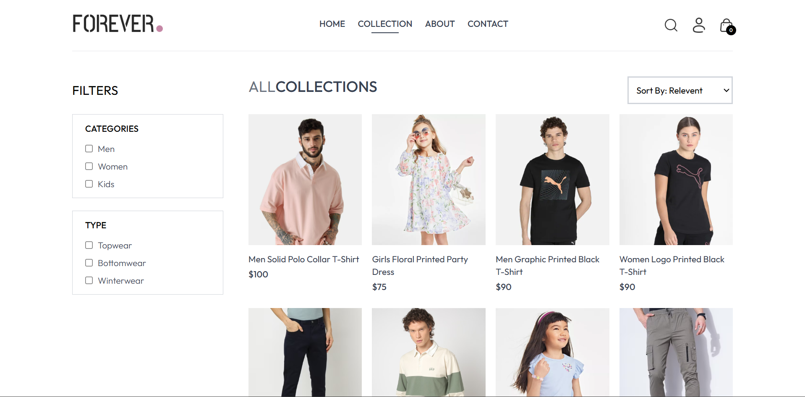
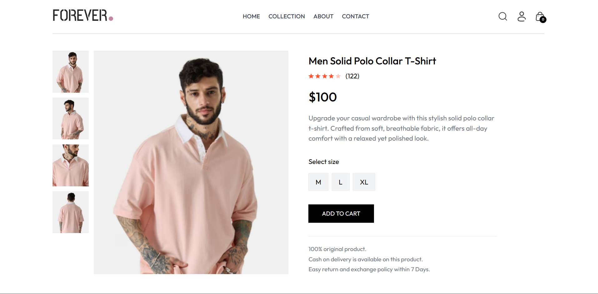
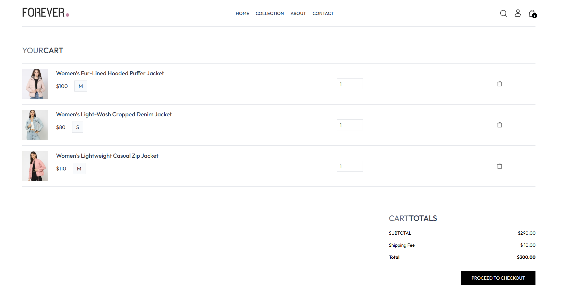
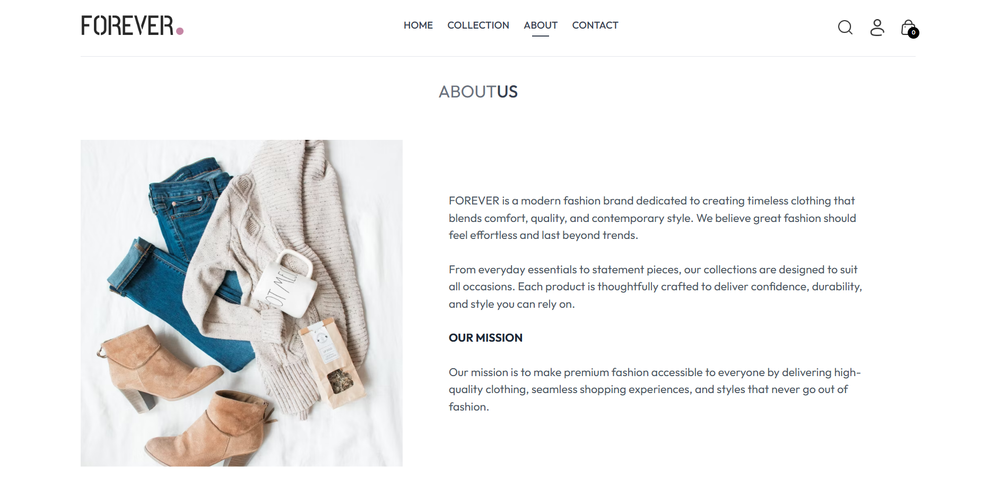
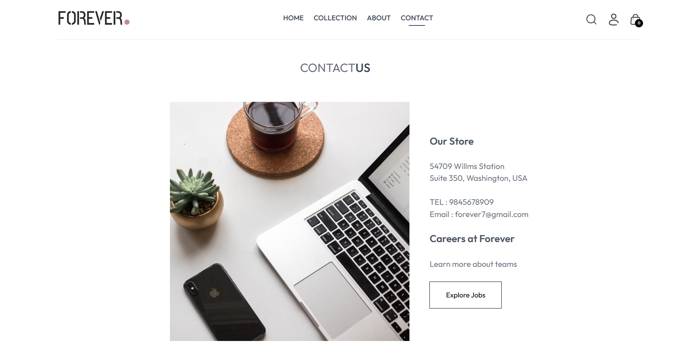
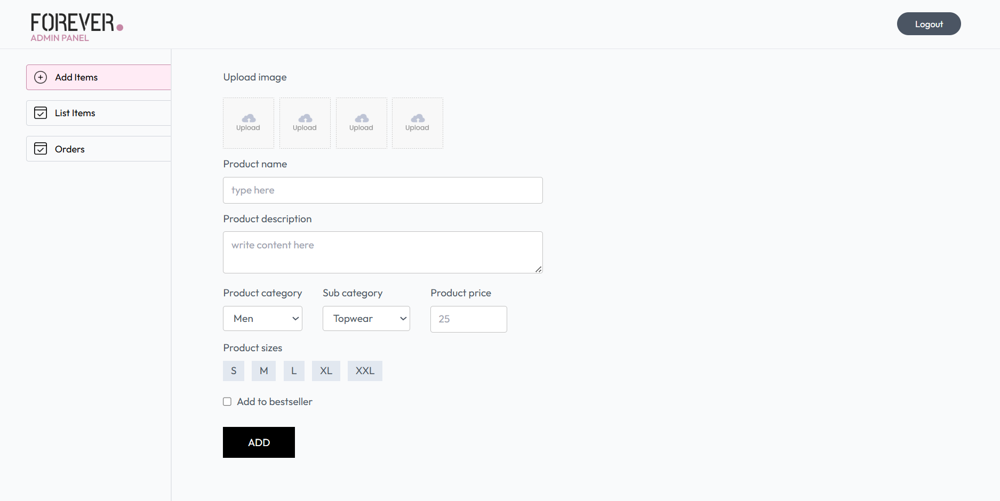
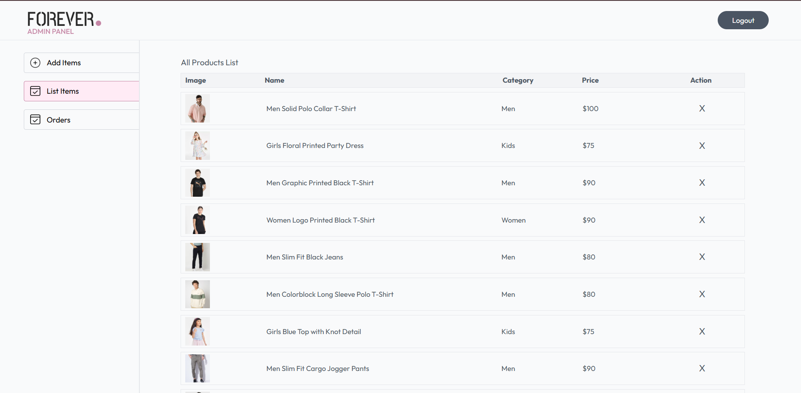

#  E-Commerce Web Application

##  Project Description
The **E-Commerce Web Application** is a full-stack web platform designed to simulate an online shopping experience.  
It enables users to browse products, view detailed information, manage a shopping cart, and place orders, while administrators can manage products and users through a dedicated admin interface.

The project focuses on **modern web development practices**, **clean user interface design**, **secure backend APIs**, and **real-world application structure** using the MERN-style architecture (without exposing sensitive data).

This application is developed as a **learning-oriented and academic project**, showcasing full-stack development skills.

---

##  Project Objectives
- To design and develop a **functional E-commerce platform**
- To implement **frontend–backend communication** using REST APIs
- To manage data efficiently using a **NoSQL database**
- To provide **secure authentication** for users and admins
- To understand **real-world project structure** and deployment readiness
- To gain hands-on experience with **full-stack development**

---

##  Technology Stack Used

### Frontend
- React.js
- HTML5
- CSS3
- JavaScript
- Axios (for API requests)

### Backend
- Node.js
- Express.js
- RESTful API architecture

### Database
- MongoDB
- Mongoose (ODM)

### Authentication & Security
- JSON Web Tokens (JWT)
- Role-based access (User / Admin)

### Tools & Platforms
- Git & GitHub
- npm (Node Package Manager)
- VS Code

---

## Application Modules

### User Module
- User registration and login
- Product browsing with images and prices
- Product detail view
- Add products to cart
- Update or remove cart items
- Place orders

### Admin Module
- Admin authentication
- Add new products
- Edit existing products
- Delete products
- View user details
- Manage product inventory

---

## Advantages
- Clean and user-friendly interface
- Modular and scalable project structure
- Secure authentication using JWT
- Separation of frontend and backend
- Real-world E-commerce workflow simulation
- Easy to extend with additional features
- Good foundation for deployment and future enhancements

---

## Limitations
- Payment gateway is not integrated
- Order tracking is basic
- No email or SMS notifications
- Not optimized for production-level traffic
- UI can be further enhanced for accessibility

---

## Screenshots

| Feature | Screenshot |
|------|-----------|
| Home Page |  |
| Home Page |  |
| Home Page |  |
| Collection |  |
| Product Details |  |
| Cart Page |  |
| About Us |  |
| Contact Us |  |
| Admin Dashboard |  |
| Admin Dashboard |  |

---

*Author*  
Dharani - Dharani373
